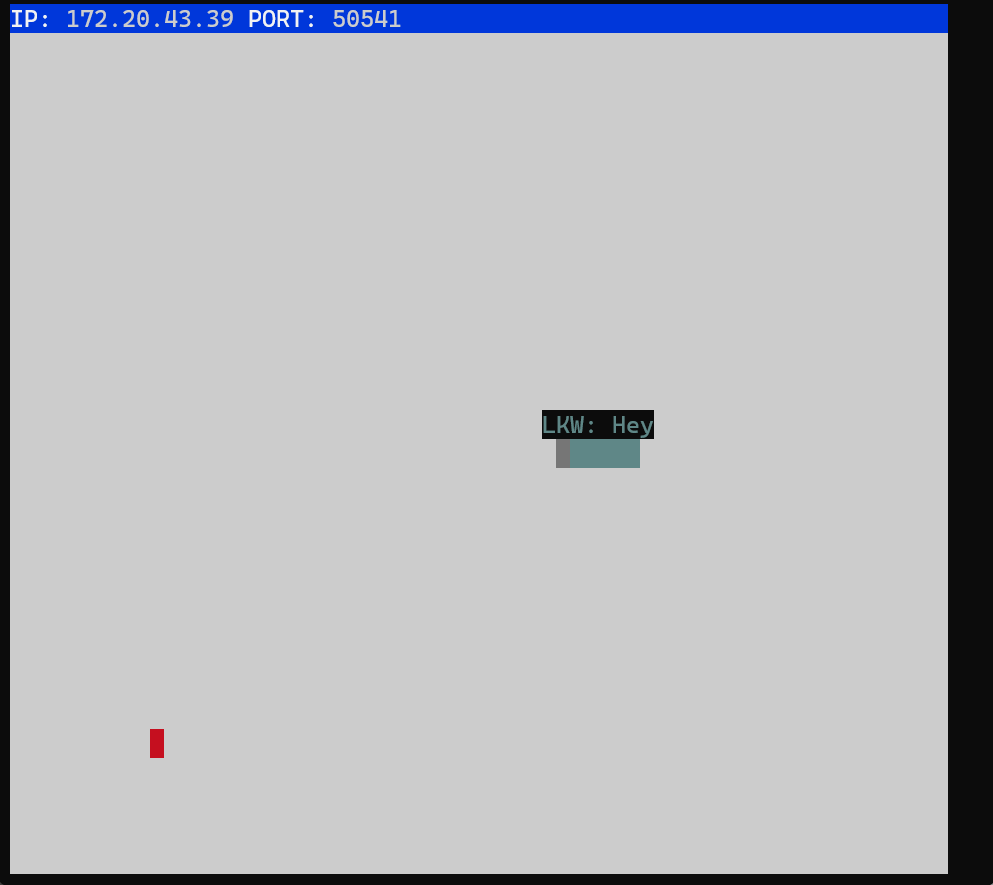
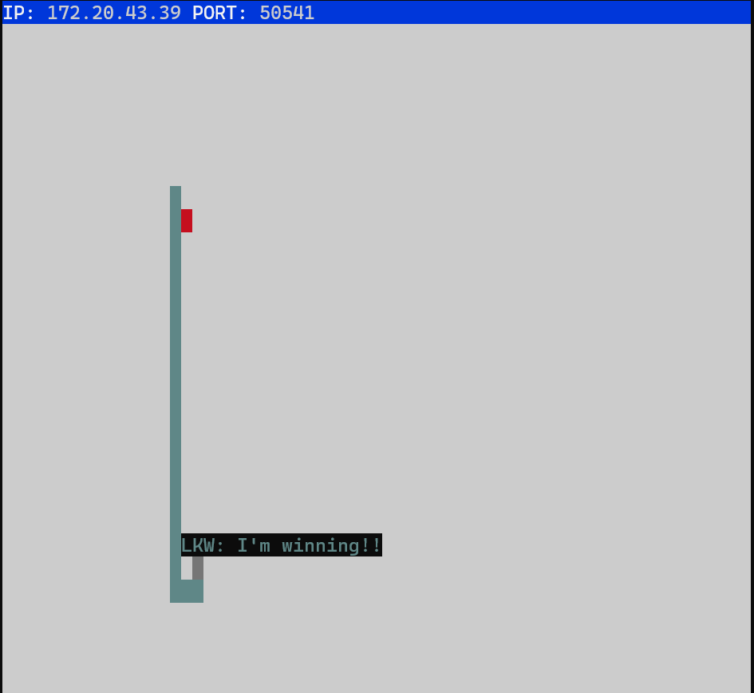

# Snake: Network Project 🐍
##### EXPLORES NETWORKING WHILST PROVIDING OPPORTUNITY TO PRACTICE PREVIOUSLY LEARNED CONCEPTS 

Through the context of building out a part of a game that runs in the terminal, we will learn how to connect a client to a server using TCP. To do so, we will leverage Node’s net module. We will also develop our familiarity with asynchronous programming as we will create event handlers that will action in response to certain events, such as receiving data or creating a connection. It's not the most beautiful game, but it should be fun nonetheless. In doing this project, we will be set up for the next part of the module's learning about HTTP, as HTTP is the "language" that both client and server use to communicate over a TCP connection.

This simple, yet addictive, game has it's players maneuver a snake around a field with the goal of 'eating' as much food (dots) as possible. With the eating of each dot, the snake grows by one. The growing snake becomes an obstacle for itself making it more and more difficult for the snake to not eat itself (you ded). The overall objective is to grow the snake as big as possible without bumping into the side walls or ingesting self.

*CREDIT: The server code for this game was not written from scratch. It is a heavily modified version of the single player game [Snek](https://github.com/taniarascia/snek) created by [Tania Rascia](https://github.com/taniarascia), but ours is a heavily modified multi-player version of the game.*

## Final Product 

## Getting Started

1. Follow steps inside the [snek server repo](https://github.com/taniarascia/snek) to run the server side
2. Run the development snake client in this repository using the `node play.js` command.

## How to Play

Use the arrow keys w, a, s, and d to move the snake up, left, down, or right. 

If the snake collides with the wall or itself the game is over. 

Press 'p' to brag that you are winning, and CTRL + C to quit the game.
